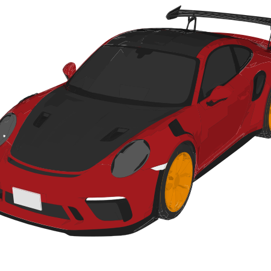
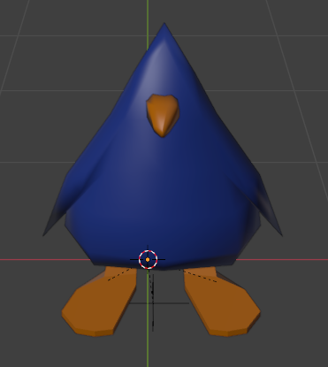
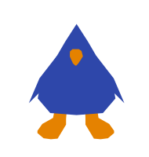

# Lottify

Filip Ďuriš

## Introduction

Lottify is a tool for generating optimized SVGs and [Lottie files](<https://en.wikipedia.org/wiki/Lottie_(file_format)>) from glTF models. Lottify aims to decrease the difficulty of creating Lotties animations. The currently available tooling is very basic, the most popular being [LottieLab](https://www.lottielab.com/dashboard) and [LottieFiles](https://lottiefiles.com), neither providing any advanced tooling and mostly just rely on simple vector graphics manipulation and interpolation. Lottify takes a different avenue, which is taking advantage the many 3D modeling tools for the creation of the animation and then simply generating an SVG or Lottie from said model.

Lottify is not a raster image to vector converter. Typical vectorization tools trace the pixels of a raster image to convert it into vector shapes. This leads to inaccuracies, gaps and poor handling of the transparent layer. Lottify vectorizes the 3D model itself without rasterizing, leading to much higher precision, ability to move, rotate or edit the model on the fly, and allowing for real-time vectorization.

**NOTICE: This is an old version of the tool. Lottify is still actively being developed privately. You can see some rendered vector graphics using lottify in [/renders](./renders)**

## Capabilities

- Vectorize arbitrary 3D model or collection of models using an edge-finding algorithm
- Turn a single vectorized frame into a still SVG or a collection of vectorized frames into an animated Lottie file
- Transform the model in 3D space before vectorization to simulate camera position and orientation
- Colour the vectorized shapes based on the colour of the model's shaders (texture support might also be a consideration)
- Re-order the vectorized shapes before exporting to simulate 3D occlusion
- Preview and edit still frames and animations in a GUI mode before exporting

## In-development

- Interpolate between frames of a Lottie animation instead of just using collection of still frames
- Automatic shape ordering computed based on 3D occlusion
- Running the algorithm on the GPU for real-time preview
- Blender plugin allowing for real-time vectorized preview while modelling 

(Some SVGs have been edited in Inkscape after rendering.)

Fig. 1: Vectorized Porche model with normal-based shading

Fig. 2: 3D Penguin Model

Fig. 3: Vectorized Penguin Model

